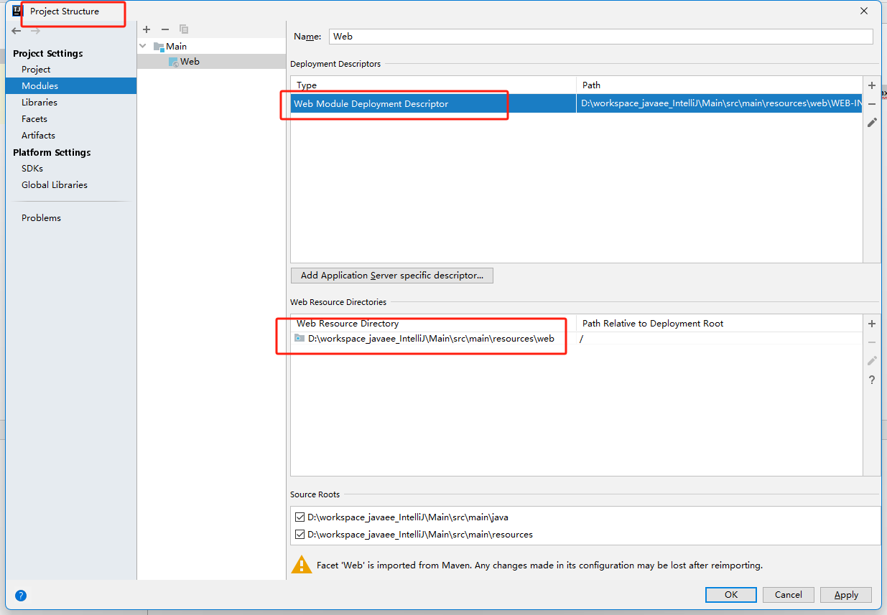
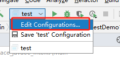
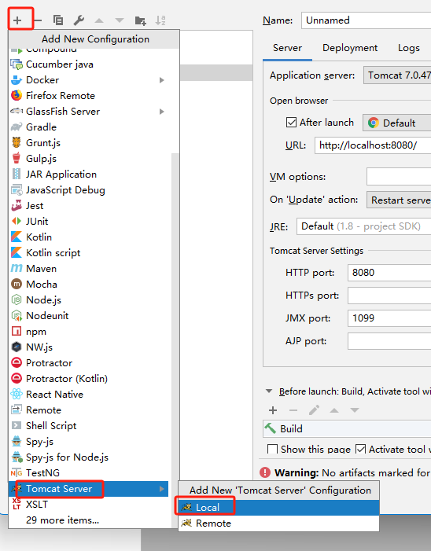
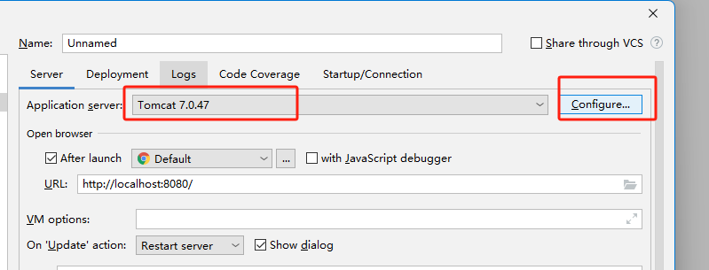
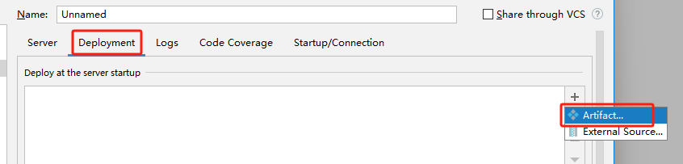
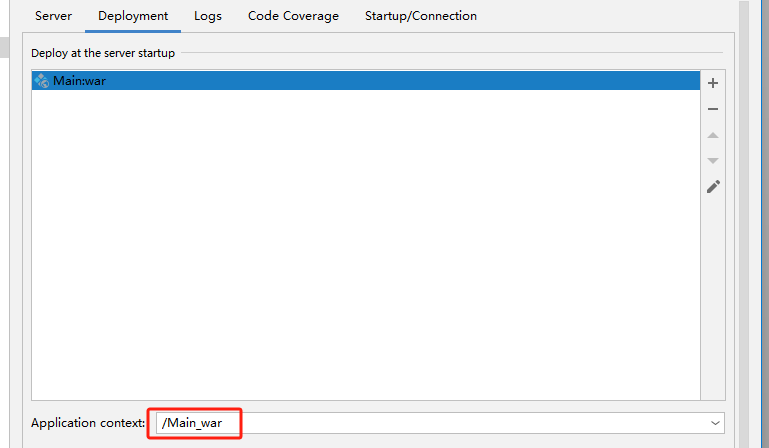

# 坐标信息
- `groupId` `com.xushu`
- `artifactId` `hello`
- `version` `1.0-SNAPSHOT`
- 以上三个确定一个jar包的位置，这是本项目的一个信息。感觉像是标记
# 项目 模块
- 项目
    - groupID 域名反过来 com.baidu
    - artifactId 项目名 OA
- 模块：OA(前台 后台 common(聚合maven项目))
    - groupID 域名反过来 com.baidu.oa
    - artifactId 模块名


- version 1.0-SNAPSHOT 还没上线最初的快照版

- `properties` 可以在其中设置变量，给其他的配置使用
```xml
<properties>
        <java.servlet.version>2.3.3</java.servlet.version>
</properties>

<dependencies>
    <dependency>
        <groupId>javax.servlet.jsp</groupId>
        <artifactId>javax.servlet.jsp-api</artifactId>
        <version>${java.servlet.version}</version>
    </dependency>
</dependencies>
```

- 修改为web项目
```xml
<packaging>war</packaging>
```



## 启动web项目
- 打开运行配置


- 选择tomcat服务器


- 先得有tomcat

- 不知道在干什么，应该是在选择展示在服务器首页程序



- 这里选完后，就是`localhost:8080\`接项目名字（可以修改为别的名字，但是运行的程序还是一样的）

- 接着就是启动！！
- 启动失败，端口被占用
```c++
netstat -ano //查询端口使用情况
//在根据pid去任务管理器中搜索并终止
```
