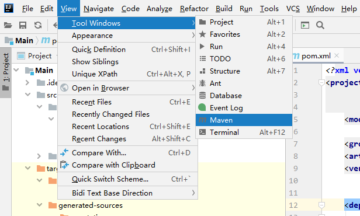
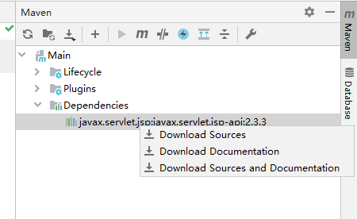

[maven网址](https://central.sonatype.com/?smo=true)
```xml
<dependency>
    <groupId>javax.servlet.jsp</groupId>
    <artifactId>javax.servlet.jsp-api</artifactId>
    <version>2.3.3</version>
</dependency>
```
- 通常idea自动给


- 这里提供一个手动下载的方式
打开maven窗口

右击下载
